Bike_Sharing
================
2024-08-17

## Changes and Info of the dataframe

``` r
#Removing useless variables 
bike_df<-subset(bike_df,select=-c(casual,registered))
bike_df$dteday <- as.Date( bike_df$dteday, format = "%Y-%m-%d")

#Provide the dimensions of the dataframe
dim(bike_df)
```

    ## [1] 731  14

``` r
#Provide the structure of all the varibales inside the dataframe
str(bike_df)
```

    ## 'data.frame':    731 obs. of  14 variables:
    ##  $ instant   : int  1 2 3 4 5 6 7 8 9 10 ...
    ##  $ dteday    : Date, format: "2011-01-01" "2011-01-02" ...
    ##  $ season    : int  1 1 1 1 1 1 1 1 1 1 ...
    ##  $ yr        : int  0 0 0 0 0 0 0 0 0 0 ...
    ##  $ mnth      : int  1 1 1 1 1 1 1 1 1 1 ...
    ##  $ holiday   : int  0 0 0 0 0 0 0 0 0 0 ...
    ##  $ weekday   : int  6 0 1 2 3 4 5 6 0 1 ...
    ##  $ workingday: int  0 0 1 1 1 1 1 0 0 1 ...
    ##  $ weathersit: int  2 2 1 1 1 1 2 2 1 1 ...
    ##  $ temp      : num  0.344 0.363 0.196 0.2 0.227 ...
    ##  $ atemp     : num  0.364 0.354 0.189 0.212 0.229 ...
    ##  $ hum       : num  0.806 0.696 0.437 0.59 0.437 ...
    ##  $ windspeed : num  0.16 0.249 0.248 0.16 0.187 ...
    ##  $ cnt       : int  985 801 1349 1562 1600 1606 1510 959 822 1321 ...

``` r
#Provide general information (Min, Quantiles, Mean and Max) about each variable 
summary(bike_df)
```

    ##     instant          dteday               season            yr        
    ##  Min.   :  1.0   Min.   :2011-01-01   Min.   :1.000   Min.   :0.0000  
    ##  1st Qu.:183.5   1st Qu.:2011-07-02   1st Qu.:2.000   1st Qu.:0.0000  
    ##  Median :366.0   Median :2012-01-01   Median :3.000   Median :1.0000  
    ##  Mean   :366.0   Mean   :2012-01-01   Mean   :2.497   Mean   :0.5007  
    ##  3rd Qu.:548.5   3rd Qu.:2012-07-01   3rd Qu.:3.000   3rd Qu.:1.0000  
    ##  Max.   :731.0   Max.   :2012-12-31   Max.   :4.000   Max.   :1.0000  
    ##       mnth          holiday           weekday        workingday   
    ##  Min.   : 1.00   Min.   :0.00000   Min.   :0.000   Min.   :0.000  
    ##  1st Qu.: 4.00   1st Qu.:0.00000   1st Qu.:1.000   1st Qu.:0.000  
    ##  Median : 7.00   Median :0.00000   Median :3.000   Median :1.000  
    ##  Mean   : 6.52   Mean   :0.02873   Mean   :2.997   Mean   :0.684  
    ##  3rd Qu.:10.00   3rd Qu.:0.00000   3rd Qu.:5.000   3rd Qu.:1.000  
    ##  Max.   :12.00   Max.   :1.00000   Max.   :6.000   Max.   :1.000  
    ##    weathersit         temp             atemp              hum        
    ##  Min.   :1.000   Min.   :0.05913   Min.   :0.07907   Min.   :0.0000  
    ##  1st Qu.:1.000   1st Qu.:0.33708   1st Qu.:0.33784   1st Qu.:0.5200  
    ##  Median :1.000   Median :0.49833   Median :0.48673   Median :0.6267  
    ##  Mean   :1.395   Mean   :0.49538   Mean   :0.47435   Mean   :0.6279  
    ##  3rd Qu.:2.000   3rd Qu.:0.65542   3rd Qu.:0.60860   3rd Qu.:0.7302  
    ##  Max.   :3.000   Max.   :0.86167   Max.   :0.84090   Max.   :0.9725  
    ##    windspeed            cnt      
    ##  Min.   :0.02239   Min.   :  22  
    ##  1st Qu.:0.13495   1st Qu.:3152  
    ##  Median :0.18097   Median :4548  
    ##  Mean   :0.19049   Mean   :4504  
    ##  3rd Qu.:0.23321   3rd Qu.:5956  
    ##  Max.   :0.50746   Max.   :8714

## Visualizations

For an initial overview of the general trend of rents, a time series
from 2011 to 2012 may be the best option.

``` r
ggplot(data= bike_df, aes(x= dteday, y= cnt)) + 
  geom_line(color= "#2de1c2") +
  labs(x= "Days", y= "Rents", title= "Number of rents 2011-2012") +
  theme_minimal() +
  theme(plot.title = element_text(hjust = 0.5))
```

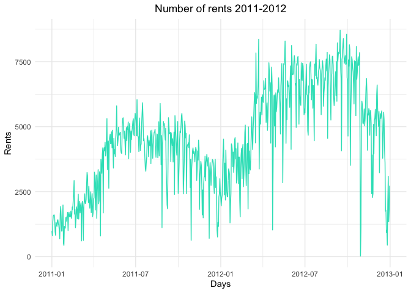<!-- -->

In order to have a better view of the trend, a line is added to provide
a clearer view

``` r
ggplot(data= bike_df, aes(x= dteday, y= cnt)) + 
  geom_line(color= "#2de1c2") +
  labs(x= "Days", y= "Rents", title= "Number of rents 2011-2012") +
  theme_minimal() +
  theme(plot.title = element_text(hjust = 0.5)) +
  stat_smooth(color= "#FE4E00", fill= "#FFAE03", method= "loess")
```

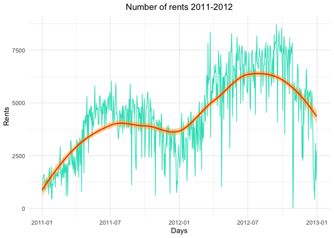<!-- -->

It’s clear that bike rentals follow a seasonal pattern, with a
noticeable decline in the winter months and a sharp increase during the
summer. Additionally, the upward trend between 2011 and 2012 indicates a
significant rise in the number of rentals over that period.

``` r
month.abb.ita <- c("Jan", "Feb", "Mar", "Apr", "May", "Jun", "Jul", "Aug", "Sep", "Oct", "Nov", "Dic")
ggplot(data = bike_df, aes(x = mnth, y = cnt)) + 
  geom_point() + 
  labs(x = "Months", y = "Rents", title = "Average monthly rent") +
  scale_x_continuous(breaks = 1:12, labels = month.abb.ita) + 
  theme_minimal() + 
  theme(plot.title = element_text(hjust = 0.5))
```

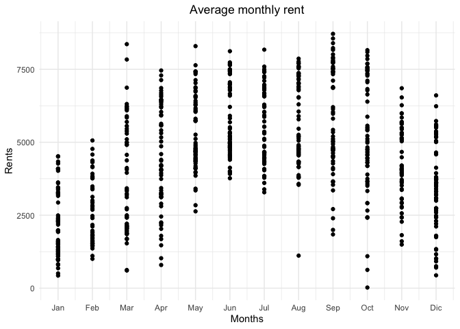<!-- -->

Once again, we can see that the number of rentals is significantly
higher during the warmer months, particularly in September and October.
This suggests a clear preference for bike-sharing in more favorable
weather conditions.

To further summarize and analyze the key characteristics of the rental
data, utilizing boxplots could be an effective approach. This method
would allow us to visually capture the distribution, central tendency,
and potential outliers within the dataset, providing deeper insights
into rental patterns across different time periods.

``` r
ggplot(data = bike_df, aes(x = mnth, y = cnt, group = mnth)) + 
  geom_boxplot(color= "#FE4E00", fill= "#2de1c2") + 
  labs(x = "Months", y = "Rents", title = "Average monthly rent") +
  scale_x_continuous(breaks = 1:12, labels = month.abb.ita) + 
  theme_minimal() + 
  theme(plot.title = element_text(hjust = 0.5))
```

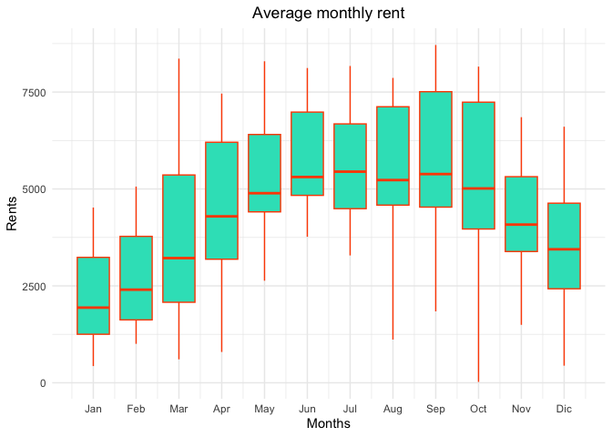<!-- -->

The median, represented by the central line in each boxplot, shows that
the rental data is not symmetrically distributed since the mean and
median values do not coincide. In a perfectly symmetrical distribution,
the most frequent value, which splits the dataset evenly, would be the
mean. To better illustrate the relationship between the mean and median,
we can enhance the boxplot by adding a white dot to indicate the mean
value.

``` r
ggplot(data = bike_df, aes(x = mnth, y = cnt, group = mnth)) + 
  geom_boxplot(color= "#FE4E00", fill= "#2de1c2") + 
  stat_summary(fun = "mean", geom = "point", col = "white", pch = 15, size = 2.5) + 
  labs(x = "Months", y = "Rents", title = "Average monthly rent - Seasonality") +
  scale_x_continuous(breaks = 1:12, labels = month.abb.ita) + 
  theme_minimal() + 
  theme(plot.title = element_text(hjust = 0.5))
```

<!-- -->

This addition suggests that bike rentals during 2011 and 2012 do not
follow a symmetric distribution.

An alternative and perhaps more effective way to visualize this data is
through a ridge plot. While boxplots provide a summary of the data,
including medians, quartiles, and potential outliers, they don’t reveal
the full shape of the data distribution. The density and ridge plots, on
the other hand, show the distribution of rental counts across different
months in much finer detail.

``` r
bike_df2 <- bike_df %>%
  mutate(mnth_fct = fct_relevel(factor(mnth), as.character(1:12))) %>%
  mutate(mnth_fct = fct_recode(mnth_fct, 
                               Jan = "1", Feb = "2", Mar = "3", Apr = "4", May = "5", Jun = "6", 
                               Jul = "7", Aug = "8", Sep = "9", Oct = "10", Nov = "11", Dic = "12")) %>%
  mutate(mnth_fct = fct_rev(mnth_fct)) # Reverse the order of the months

ggplot(bike_df2, aes(x = cnt, y = mnth_fct, fill = stat(x))) +
  geom_density_ridges_gradient(stat = "binline", draw_baseline = FALSE, scale = 0.95) +
  scale_fill_gradient(low = "blue", high = "red", name = "Rents") + 
  labs(y = "Months", x = "Rents", title = "Average monthly rent - Distribution") +
  theme_minimal() + 
  theme(plot.title = element_text(hjust = 0.5))
```

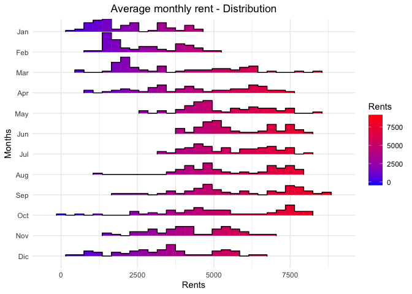<!-- -->

To improve the clarity of the graph, the histogram can be replaced with
a more visually appealing format that better highlights the seasonality.

``` r
ggplot(bike_df2, aes(x = cnt, y = mnth_fct, fill = stat(x))) +
  geom_density_ridges_gradient(scale = 0.95) +
  scale_fill_gradient(low = "blue", high = "red", name = "Rents") + 
  labs(y = "Months", x = "Rents", title = "Average monthly rent - Distribution") +
  theme_minimal() + 
  theme(plot.title = element_text(hjust = 0.5))
```

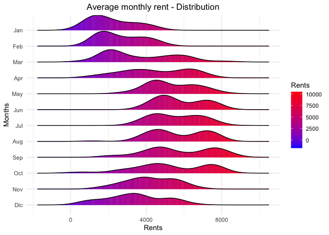<!-- -->

``` r
month_names <- c("Jan", "Feb", "Mar", "Apr", "May", "Jun", 
                 "Jul", "Aug", "Sep", "Oct", "Nov", "Dec")

weekday_names <- c("Mon", "Tue", "Wed", "Thu", "Fri", "Sat", "Sun")

ggplot(bike_df, aes(x = factor(mnth, levels = 1:12, labels = month_names), 
                    y = cnt, 
                    fill = factor(weekday, levels = 0:6, labels = weekday_names))) +
  geom_col() + 
  labs(x = "Months", y = "Rents", title = "Monthly Distribution of Rents by Weekday", fill= "Weekday") +
  theme_minimal() + 
  theme(plot.title = element_text(hjust = 0.5)) +
  scale_y_continuous(labels = scales::comma) 
```

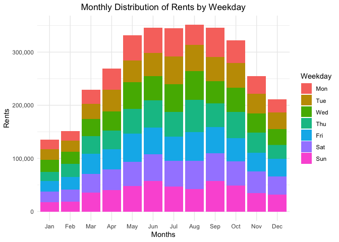<!-- -->

``` r
years <- c("2011", "2012")

ggplot(bike_df,aes(x=factor(yr, labels= years), y=cnt))+
  geom_violin() +
  labs(x='Years',y='Rents',title='Yearly rent distributions', fill= "Year") +
  theme_minimal() +
  theme(plot.title = element_text(hjust = 0.5))
```

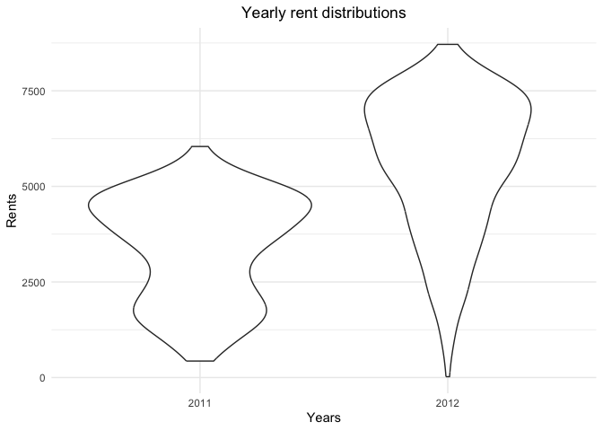<!-- -->

``` r
# Assuming 'holidays' and 'season' are predefined vectors of labels
holiday_labels <- c("No Holiday", "Holiday")  
season_labels <- c("Spring", "Summer", "Fall", "Winter") 

ggplot(bike_df, aes(x = factor(holiday, levels = 0:1, labels = holiday_labels), 
                    y = cnt, 
                    fill = factor(season, levels = 1:4, labels = season_labels))) + 
  geom_col() + 
  theme_bw() +  
  labs(x = "Holiday", y = "Rents", title = "Rents Distribution by Festivity", fill = "Season") + 
  theme(plot.title = element_text(hjust = 0.5)) +
  scale_y_continuous(labels = scales::comma)  
```

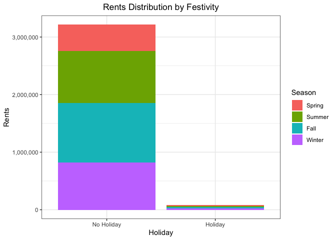<!-- -->

The graph clearly indicates that the number of rentals is significantly
lower during the holidays, likely due to the limited number of holidays
compared to regular days.

``` r
workingd <- c("No Working day", "Working day")

ggplot(bike_df, aes(x = factor(workingday, levels = 0:1, labels = workingd), 
                    y = cnt, 
                    fill = factor(season, levels = 1:4, labels = season_labels))) + 
  geom_col() + 
  theme_bw() +  
  labs(x = "Workingday", y = "Rents", title = "Rents Distribution by Working day", fill = "Season") + 
  theme(plot.title = element_text(hjust = 0.5)) +
  scale_y_continuous(labels = scales::comma)  
```

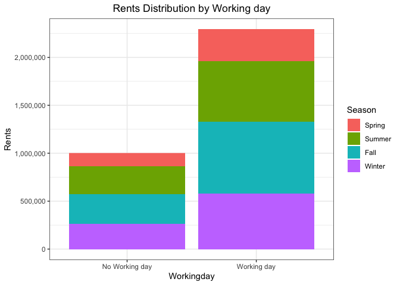<!-- -->

When weekends are also considered alongside holidays, the number of
rentals increases. However, rentals during weekdays remain higher.

``` r
weather <- c("Clear sky", "Cloudy sky", "Light precipitation", "Heavy precipitation")

ggplot(bike_df, aes(x= factor(weathersit, levels = 1:4, labels = weather),
       y= cnt,
       fill = factor(season, levels = 1:4, labels = season_labels))) +
  geom_col() + 
  theme_bw() +  
  labs(x = "Weather", y = "Rents", title = "Rents Distribution by type of Weather", fill = "Season") + 
  theme(plot.title = element_text(hjust = 0.5)) +
  scale_y_continuous(labels = scales::comma)  
```

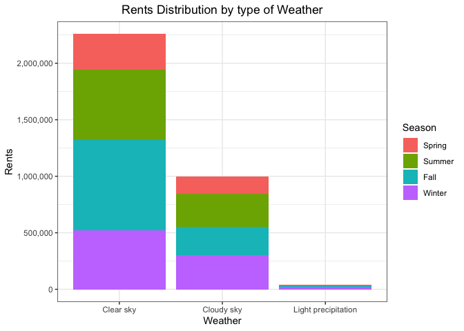<!-- -->

The graph reveals that the majority of bike-sharing activity occurs
during favorable weather conditions, with clear skies being the most
common. This is followed by periods of overcast skies, where bike usage
slightly declines but remains significant. Finally, the graph indicates
that light precipitation leads to the lowest levels of bike-sharing, as
riders tend to avoid cycling in wet conditions. This pattern highlights
the strong influence of weather on biking habits, with people preferring
to ride when the weather is more comfortable and avoiding it when
conditions are less favorable.

While the weather graphs provided a broad overview of how general
conditions affect bike usage, they did not fully capture the nuanced
impact of specific factors like temperature, humidity, and wind speed.
To gain deeper insights into these variables, a boxplot analysis can be
conducted. This method allowes for a more precise examination of the
distribution and variability of each weather factor, as well as the
identification and removal of outliers. By doing so, the study could
focus on the typical range of conditions that most significantly
influence bike-sharing behavior.

### Outliers for temperature, humidity and wind speed:

``` r
#Insert the boxplot in three different columns in one row
par(mfrow=c(1,3)) 

#Box plot for temoperature
boxplot(bike_df$temp, main="Temperature",col="plum1",horizontal=F)
  
#Box plot for humidity
boxplot(bike_df$hum,main="Humidity",col="cadetblue1",horizontal=F)

#Box plot for wind speed 
boxplot(bike_df$windspeed,main="Wind Speed",col="darkolivegreen3",horizontal=F)
```

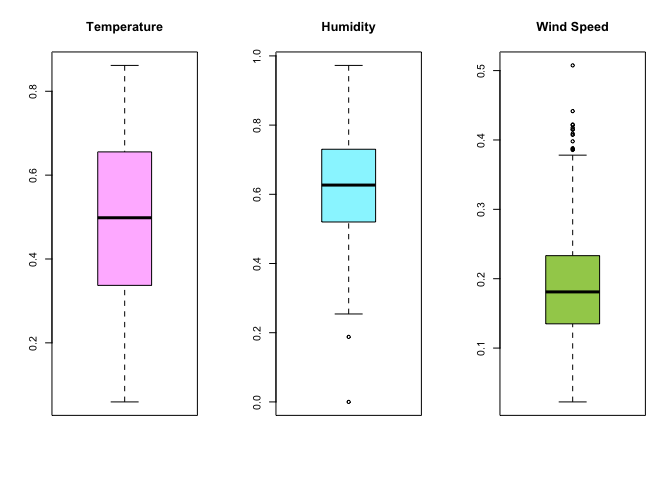<!-- -->

Since the temperature values doesn’t present outliers, only humidity and
wind speed require the removal

Outliers humidity

``` r
QH <- quantile(bike_df$hum, probs=c(.25, .75), na.rm = T)
iqrH <- IQR(bike_df$hum, na.rm = T)

# remove the outlier beyond 1.5 * iqr for Rentals
bike_sharing2 <- bike_df %>% filter(hum > (QH[1] - 1.5*iqrH) & 
                                      hum < (QH[2]+1.5*iqrH))  

# visualize the new dataset without outliers
par(mfrow=c(2,1))
options(repr.plot.width=10, repr.plot.height=7)
boxplot(bike_df$hum, col = "cadetblue1", main = "Humidity before outliers removal", horizontal = T) 
boxplot(bike_sharing2$hum, col = "cadetblue1", main = "Humidity after outliers removal", horizontal = T)
```

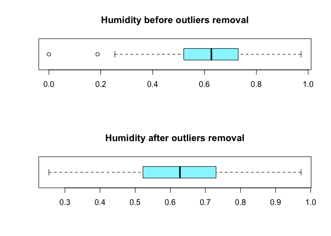<!-- -->

Outliers windspeed

``` r
# Calculate quantiles and IQR for windspeed
QW <- quantile(bike_df$windspeed, probs = c(.25, .75), na.rm = T)
iqrW <- IQR(bike_df$windspeed, na.rm = T)

# Filter out the outliers for windspeed
bike_sharing2 <- bike_df %>%
  filter(windspeed > (QW[1] - 1.25 * iqrW) & 
         windspeed < (QW[2] + 1.25 * iqrW))

# Visualize the result
par(mfrow = c(2,1))
options(repr.plot.width = 10, repr.plot.height = 7)
boxplot(bike_df$windspeed, col = "darkolivegreen3", main = "Windspeed before outliers removal", horizontal = T) 
boxplot(bike_sharing2$windspeed, col = "darkolivegreen3", main = "Windspeed after outliers removal", horizontal = T)
```

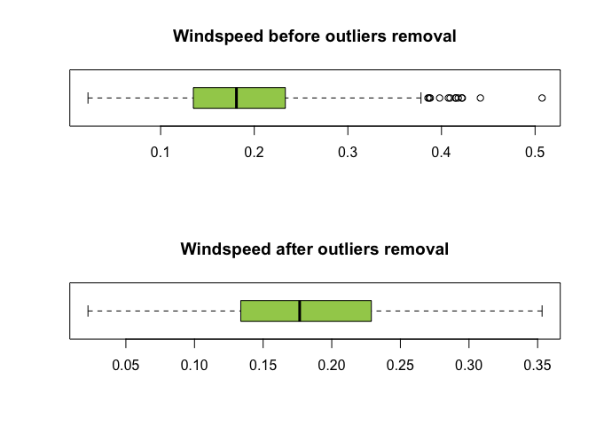<!-- -->

The removal of outliers is particularly important to ensure that the
analysis focused on normal conditions rather than being skewed by rare,
extreme weather events, which could distort the findings. For instance,
an outlier in wind speed might represent an unusually strong storm that,
while interesting, does not reflect the usual conditions under which
most bike-sharing occurs. By excluding such outliers, the study could
more accurately capture the relationship between these variables and
bike usage under typical circumstances.

Furthermore, this approach enhances the reliability and accuracy of any
predictive models developed as part of the study. Outliers can introduce
noise and reduce the model’s ability to generalize to everyday
conditions, leading to less accurate predictions. By removing these
outliers, the analysis and any resulting models are more likely to
produce insights that are both relevant and actionable for
decision-makers, such as bike-sharing companies or urban planners.
Overall, this method ensures that the study’s conclusions are grounded
in the data that most accurately represents regular biking conditions.

## Correlations

Let’s investigate the correlation of the different variables in the
dataframe

``` r
#In order to get the correlation, all interested variables need to be converted into numeric
bike_df$yr<-as.numeric(bike_df$yr)
bike_df$mnth<-as.numeric(bike_df$mnth)
bike_df$season <- as.numeric(bike_df$season)
bike_df$holiday<- as.numeric(bike_df$holiday)
bike_df$weekday<- as.numeric(bike_df$weekday)
bike_df$workingday<- as.numeric(bike_df$workingday)
bike_df$weathersit<- as.numeric(bike_df$weathersit)

#Correlation
data <- bike_df %>% 
  select(season, temp, atemp, weathersit, mnth, yr, holiday, weekday, workingday,holiday ) %>%
  drop_na()
round(cov(data), 2)
```

    ##            season  temp atemp weathersit  mnth    yr holiday weekday workingday
    ## season       1.23  0.07  0.06       0.01  3.19  0.00    0.00   -0.01       0.01
    ## temp         0.07  0.03  0.03      -0.01  0.14  0.00    0.00    0.00       0.00
    ## atemp        0.06  0.03  0.03      -0.01  0.13  0.00    0.00    0.00       0.00
    ## weathersit   0.01 -0.01 -0.01       0.30  0.08 -0.01    0.00    0.03       0.02
    ## mnth         3.19  0.14  0.13       0.08 11.92  0.00    0.01    0.07      -0.01
    ## yr           0.00  0.00  0.00      -0.01  0.00  0.25    0.00   -0.01       0.00
    ## holiday      0.00  0.00  0.00       0.00  0.01  0.00    0.03   -0.03      -0.02
    ## weekday     -0.01  0.00  0.00       0.03  0.07 -0.01   -0.03    4.02       0.03
    ## workingday   0.01  0.00  0.00       0.02 -0.01  0.00   -0.02    0.03       0.22

``` r
#Correlation plot 
corrplot(corr= cor(bike_df[3:14]),
         method = "circle",
         type = "full",
         tl.pos = "tl",
         order= "original")
```

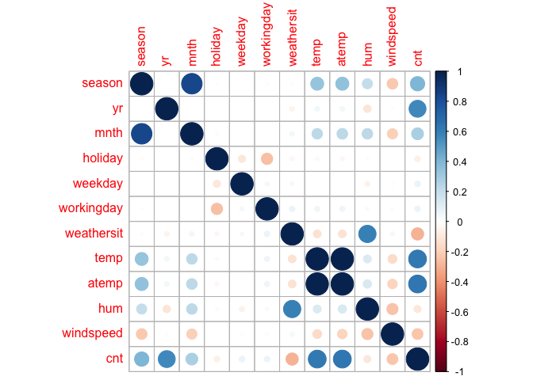<!-- -->

The covariance matrix reveals several insights into the relationships
between the variables. A notable observation is the strong positive
covariance between the season and month variables, which reflects the
natural progression of months through different seasons. This
relationship is expected, given that the month of the year directly
influences the season.

When examining the weather situation in relation to temperature and
apparent temperature, a slight negative covariance is observed. This
suggests that as weather conditions worsen (for example, during rain or
snow), temperatures tend to be slightly lower, though this relationship
appears to be relatively weak.

Additionally, the positive covariance between the month and both
temperature and apparent temperature indicates that as the year
progresses, particularly moving from winter to summer, temperatures
generally increase. This is consistent with typical seasonal weather
patterns.

Other relationships in the matrix, such as those involving holidays,
weekdays, and working days, show little to no significant covariance
with the other variables. These minimal values suggest that holidays and
weekdays do not strongly covary with other factors like temperature,
season, or weather conditions in this dataset, indicating a more
independent relationship.
